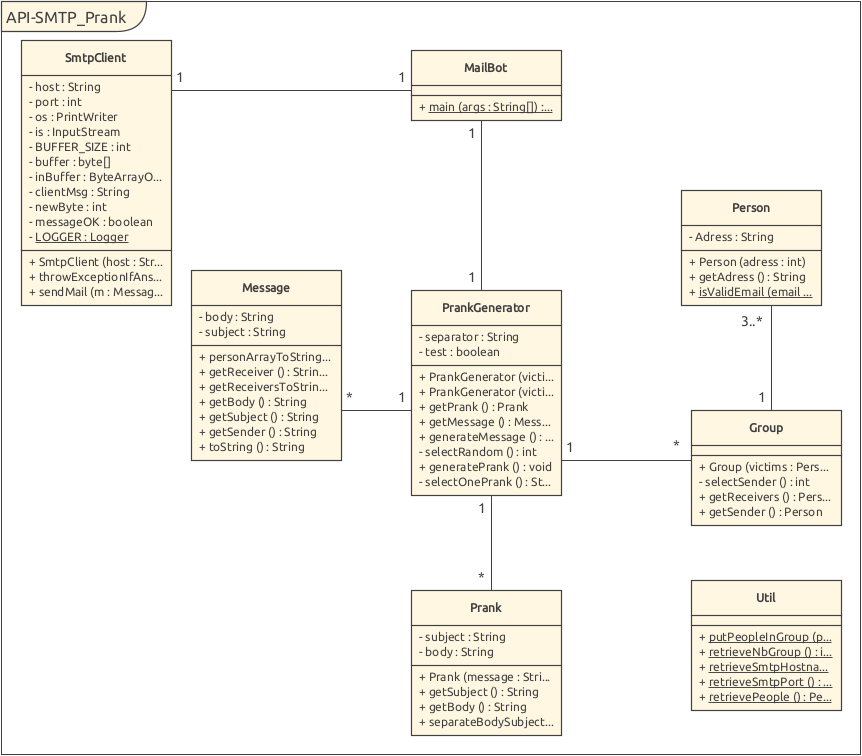

# API - Labo SMTP
Auteurs :
Guilain Mbayo,
Mehdi Salhi

## Description
Ce projet a pour but de récupérer des addresses mail dans une
liste afin de créer des groupes et d'envoyer un mail forgé contenant
un prank à chacun des groupes. L'expéditeur apparent du message est 
sélectionné de manière aléatoire parmi les adresses d'un groupe.

### Diagramme de classes UML
Ce diagramme représente l'architecture de notre application. À noter que la 
classe Util n'est pas associée aux autres classes, car il s'agit de méthodes 
utilitaires statiques sans lien en particulier à l'une ou l'autre classe.



## Setup Instructions

### Serveur test & Docker
Nous avons mis a disposition un Dockerfile afin de créer une image docker
avec un serveur test. Nous utilisons l'application MockMock pour créer un 
serveur de test qui reçoit les e-mails. Cela permet de deployer rapidement 
un serveur pour tester des campagnes de pranks.

Dans le dossier docker, en ligne de commande, exécuter la commande :
```
docker build -t mockmock .
```
Cette commande va télécharger le serveur MockMock depuis git et construire
un conteneur Docker. Il faut ensuite lancer l'image Docker avec la commande
suivante :
```
docker run -p 25000:25000 -p 8282:8282 -it mockmock
```
Cela permet de lancer le serveur de test dans le conteneur Docker en mappant
les ports internes du conteneur vers l'extérieur afin de les rendre
accessible. Une fois fait, le serveur MockMock est accessible depuis un
navigateur web à l'adresse :
```
localhost:8282
```

### Application principale
- Cloner le répertoire git avec la commande
```
git clone https://github.com/MehSalhi/API-2021-SMTP
```
- Ouvrir et compiler l'application
- Modifier les fichiers de configuration selon les instructions dans la section "Configuration d'utilisations et instructions"
- Exécuter la classe MailBot

## Configuration et instructions d'utilisation
#### Adresses mail
Les addresses mail à utiliser doivent être écrites dans le fichier 
victims.UTF8 (./src/main/java/config/victims.UTF8). Une seule adresse ne doit 
être indiquée par ligne.
#### Prank
Les pranks doivent être écrit dans le fichier message.UTF8
(./src/main/java/config/message.UTF8). Chaque prank est séparé par le 
séparateur :
```
<==========>
```
Dans chaque prank, la première ligne est le sujet du
prank tandis que le reste est le corp du prank.
#### Configuration
Le fichier properties.properties (./src/main/java/config/properties.properties)
contient les indications sur le serveur et sur le nombre de groupes voulu.
Pour assurer le bon fonctionnement du programme, il est impératif de 
respecter le format suivant :
- première ligne :
  - **smtpServerAdresse=\<server address\>**
- seconde ligne :
  - **smtpServerPort=\<server port\>**
- troisième ligne :
  - **numberOfGroups=\<number of groups\>**
  
*remarque : le nombre de groupes doit être tel que 3 adresse peuvent être
attribuée par groupe, sinon le programme ne fonctionnera pas*

#### Exemple setup & utilisation typique

```
// Build & execution du serveur de test
// Depuis le répertoire souhaité:
git clone https://github.com/MehSalhi/API-2021-SMTP
cd API-2021-SMTP/
cd docker
docker build -t mockmock .
docker run -p 25000:25000 -p 8282:8282 -it mockmock
// Depuis un navigateur web se rendre à l'adresse
localhost:8282

Client
1) Modifier les fichiers de configurations 
dans le répertoire API-2021-SMTP/src/main/java/config
  - message.UTF8 : contient les canulars qui seront envoyés
  - properties.properties : contient les propriétés générales
  - victims.UTF8 : contient les adresses e-mails des victimes
2) Executer la classe principale Mailbot qui se trouve dans src/main/java/

Pour terminer le serveur SMTP
Faire CTRL+C dans le terminal ou le serveur est lancé s'il est toujours 
attaché au terminal, sinon:

// Récupérer le nom du container docker en cours d'execution
docker ps
docker kill "container name"

Notes: 
1) il se peut qu'il faille ajouter "sudo" devant les commandes
2) Si la connexion avec le serveur ne fonctionne pas, vérifier la 
configuration de votre firewall
3) Rajouter & à la fin de la commande docker build... afin de récupérer le 
contrôle du terminal pendant que le serveur s'execute en fond

```


## Implementation
Notre programme principal se trouve dans la classe MailBot. Cette classe
se charge de récupérer les paramètres du fichier properties.properties
grâce aux méthodes contenues dans la classe Util. Elle crée ensuite les
différents groupes en leur passant en paramètres un nombre variable de 
Person grâce à une méthode qui est également contenue dans la 
classe Util. La classe groupe se charge de sélectionner un expéditeur parmi
les Person passées en paramètre. Ensuite, MailBot crée un message par groupe 
grâce à une instance de la 
classe PrankGenerator.

PrankGenerator crée tout d'abord un Prank en lui passant en paramètre l'un 
des pranks contenus dans le fichier message.UTF8 et sélectionné de manière
aléatoire. La classe prank se charge de découper le prank en un sujet et
un corps. Ensuite, PrankGenerator crée un Message en lui passant en paramètre
l'expéditeur du groupe, les victimes du groupe, le sujet du prank et son corps.

La classe message se charge de formater les différents éléments qui lui sont 
passés en paramètre de manière à avoir un message composé de chaînes de caractères
utilisable (body, subject, sender et receivers).

Mailbot transmet ensuite le message ainsi généré par PrankGenerator à une
instance de la Classe SmtpClient.

Ce sera finalement cette classe SmtpClient qui se chargera d'ouvrir une connexion
avec le serveur, puis de lui communiquer le message au format SMTP avant de clore
la connexion.

Un nouveau message et une nouvelle connexion SMTP sont générés pour chacun
des groupes qui auront été créés plus tôt.

## Exemple de dialogue entre le client et le serveur SMTP
Légende: S = Serveur, C = Client

```
*** le client initialise la connexion au serveur***

S: 220 05ab97270089 ESMTP MockMock SMTP Server version 1.4
C: EHLO 05ab97270089
S: 250-05ab97270089
   250-8BITMIME
   250 Ok
C: MAIL FROM:<toto@toto123.ch>
S: 250 Ok
C: RCPT TO:<tata@tata123.ch>
S: 250 Ok
C: RCPT TO:<titi@titi123.ch>
S: 250 Ok
C: RCPT TO:<tutu@tutu123.ch>
S: 250 Ok
C: DATA
S: 354 End data with <CR><LF>.<CR><LF>
C: From: toto@toto123.ch
   To: tata@tata123.ch, titi@titi123.ch, tutu@tutu123.ch
   Content-Type: text/plain; charset=utf-8
   After several years of [...]
   .
S: 250 Ok
C: QUIT
S: 221 Bye
```
